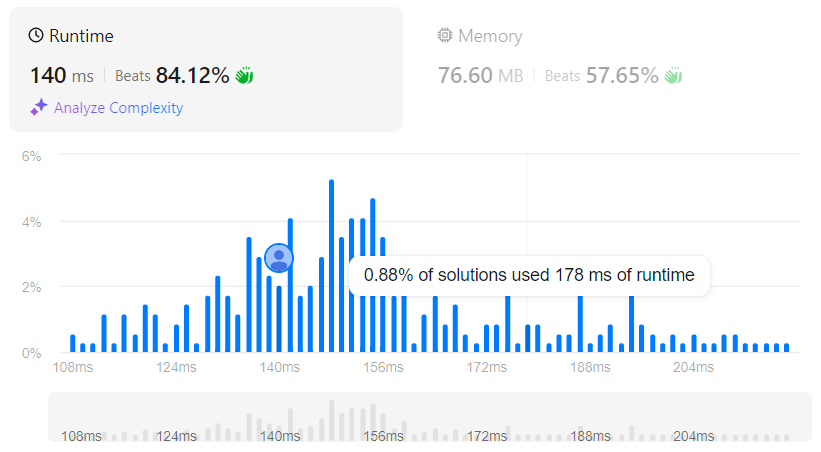

# Average Waiting Time
## Link
[Average Waiting Time](https://leetcode.com/problems/average-waiting-time/description)

## Code
```cpp
class Solution {
public:
    double averageWaitingTime(vector<vector<int>>& customers) {
        double sum=0;
        double lf=0;

        lf=customers[0][0]+customers[0][1];
        sum=customers[0][1];
        for(int i=1;i<customers.size();++i){
            if(lf>customers[i][0]){
                lf+=customers[i][1];
                sum+=(lf-customers[i][0]);
            }
            else{
                lf=customers[i][0]+customers[i][1];
                sum+=customers[i][1];
            }
        }

        return sum/customers.size();
    }
};
```

## Evaluation
