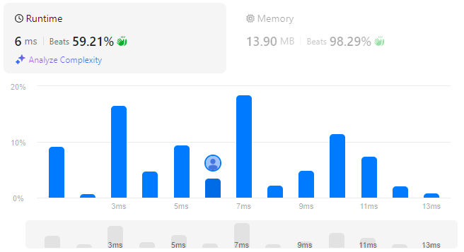

# Sort Array by Increasing Frequency
## Link
[Sort Array by Increasing Frequency](https://leetcode.com/problems/sort-array-by-increasing-frequency/)

## Code
```cpp
class Solution {
private:
    static inline bool cmp(pair<int, int> a, pair<int, int> b){
        if(a.second==b.second){
            return a.first>b.first;
        }

        return a.second<b.second;
    }
public:
    vector<int> frequencySort(vector<int>& nums) {
        int len = nums.size();
        vector<int> ans;

        if(!len)    return ans;

        sort(nums.begin(), nums.end());

        vector<pair<int,int>> tp;
        
        tp.push_back({nums[0], 1});
        for(int i=1;i<len;++i){
            if(nums[i]==nums[i-1]){
                tp.back().second++;
            }
            else{
                tp.push_back({nums[i], 1});
            }
        }

        sort(tp.begin(), tp.end(), cmp);

        for(int i=0;i<tp.size();++i){
            for(int j=0;j<tp[i].second;++j){
                ans.push_back(tp[i].first);
            }
        }

        return ans;
    }
};
```

## Evaluation
