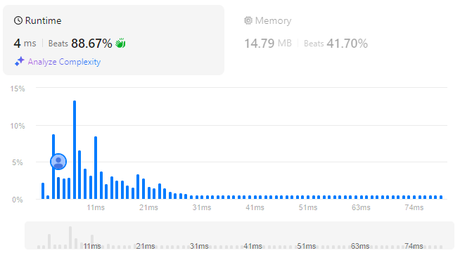

# All Paths From Source to Target
## Link
[All Paths From Source to Target](https://leetcode.com/problems/all-paths-from-source-to-target/)

## Code
```cpp
class Solution {
private:
    vector<vector<int>> ans;
    vector<int> unit;

    void core(vector<vector<int>>& graph, int index){
        if(graph[index].size()==0)  return ;
        for(auto i: graph[index]){
            if(i==graph.size()-1){
                unit.push_back(graph.size()-1);
                ans.push_back(unit);
                unit.pop_back();
            }
        }

        for(int i=0;i<graph[index].size();++i){
            unit.push_back(graph[index][i]);
            core(graph, graph[index][i]);
            unit.pop_back();
        }
    }
public:
    vector<vector<int>> allPathsSourceTarget(vector<vector<int>>& graph) {
        int len = graph.size();
        unit.push_back(0);

        core(graph, 0);
        return ans;
    }
};
```

## Evaluation
