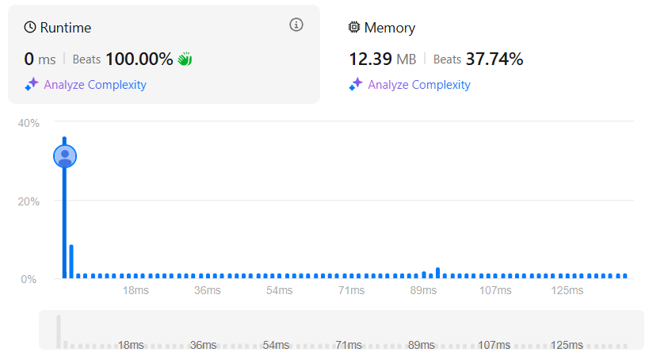

# Robot Collisions
## Link
[Minimum Number of Operations to Move All Balls to Each Box](https://leetcode.com/problems/minimum-number-of-operations-to-move-all-balls-to-each-box/description/)

## Code
```cpp
class Solution {
public:
    vector<int> minOperations(string boxes) {
        vector<int> ans(boxes.size(),0);
        int lf=0, rt=0;
        int sumlf=0, sumrt=0;
        for(int i=1;i<boxes.size();++i){
            if(boxes[i]=='1'){
                rt++;
                sumrt+=i;
            }
        }

        ans[0]=sumrt;
        for(int i=1;i<boxes.size();++i){
            if(boxes[i-1]=='1'){
                lf++;
            }
            sumlf=lf+sumlf;

            if(boxes[i]=='1'){
                sumrt--;
                rt--;
            }
            sumrt=sumrt-rt;

            ans[i]=sumlf+sumrt;
        }

        return ans;
    }
};
```

## Evaluation
