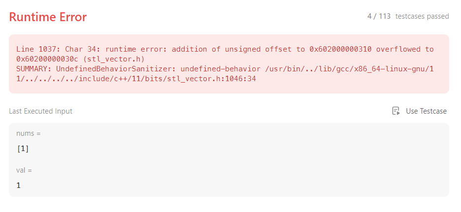
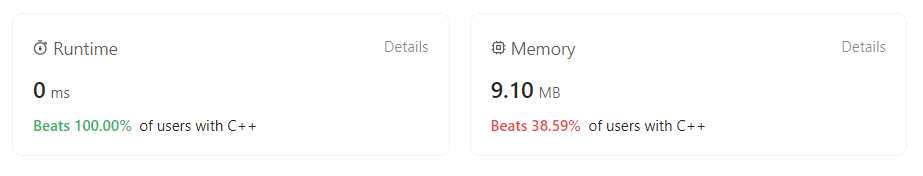

# ***Remove Element***
## Puzzle Description
Given an integer array ***nums*** and an integer ***val***, remove all occurrences of ***val*** in ***nums*** in-place. The order of the elements may be changed. Then return the number of elements in ***nums*** which are not equal to ***val***.   
Refer to Leetcode link [Remove Element](https://leetcode.com/problems/remove-element/description/)

Consider the number of elements in ***nums*** which are not equal to ***val*** be ***k***, to get accepted, you need to do the following things:

* Change the array ***nums*** such that the first ***k*** elements of ***nums*** contain the elements which are not equal to ***val***. The remaining elements of ***nums*** are not important as well as the size of ***nums***.
* Return ***k***.

## Methodology
Find all the ***val*** starting from the left side, then swap the ***val*** with the last element which is not ***val***.

## Code
```c++
int removeElement(vector<int>& nums, int val) {
    int len=nums.size();
    int left=0, right=len-1, offset=0;

    while(left<=right-offset){
        while(nums[right-offset]==val)
        {
            offset++;
        }
        if(offset==len){
            return 0;
        }
        if(nums[left]==val){
            int tp;
            tp=nums[left];
            nums[left]=nums[right-offset];
            nums[right-offset]=tp;
            left++;
            offset++;
        }
        else{
            left++;
        }
    }
    return len-offset;
}
```

**Remark: There is a vulnerability existing as shown below.**
```c++
int removeElement(vector<int>& nums, int val) {
    int len=nums.size();
    int left=0, right=len-1, offset=0;

    while(left<=right-offset){
        while(nums[right-offset]==val)
        {
            offset++;
        }

        if(offset==len){
            return 0;
        }
```
the ***if*** sentence should be put into the second layer while loop. If we write the code like above, it will cause that when ***offset==len***, the second ***while*** loop won't stop but continue to check whether ***nums[right-offset]==val*** when ***right-offset=-1***. This will cause **stackoverflow** and **stack information leakage**. The error information is shown below:   



And there actually exists other bugs.

So we give the modified correct code as shown below:
```c++
int removeElement(vector<int>& nums, int val) {
    int len=nums.size();
    int left=0, right=len-1, offset=0;

    while(left<=right-offset){
        while(nums[right-offset]==val)
        {
            offset++;
            if(offset==len){
                return 0;
            }
        }
        if(left>right-offset){
            break;
        } 
        if(nums[left]==val){
            int tp;
            tp=nums[left];
            nums[left]=nums[right-offset];
            nums[right-offset]=tp;
            left++;
            offset++;
        }
        else{
            left++;
        }
    }
    return len-offset;
}
```
In this code block we add boundary check after the second ***while*** loop as shown below to avoid bypassing the checking condition in the first ***while*** loop.
```c++
    if(left>right-offset){
        break;
    } 
```

## Evaluation


## Comment by the author
Actually the correct code which is shown above could also been used to solve another puzzle "Move the elements which is as the same value as ***val*** to the end part of the array". There is another method which is more memory friendly and also not wasting much time. The code is shown below:
```c++
class Solution {
public:
    int removeElement(vector<int>& nums, int val) {
        int index = 0;
        for(int i = 0; i< nums.size(); i++){
            if(nums[i] != val){
                nums[index] = nums[i];
                index++;
            }
        }
        return index;
    }
};
```
