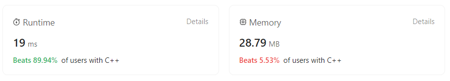

# Squares of a sorted array
## Puzzle Description
Given an integer array ***nums*** sorted in **non-decreasing** order, return an array of **the squares of each number** sorted in *non-decreasing* order.   
Refer to [Leetcode squares-of-a-sorted-array](https://leetcode.com/problems/squares-of-a-sorted-array/).

## Methodology
Since the array is a sorted array, we could compute the square of the elements first, then we process the elements in the array by the way that comparing the left side element square and the right side element square, push the larger one into the end of a newly generated array. In the end, we return the newly generatd array.

## Code
```c++
class Solution {
public:
    vector<int> sortedSquares(vector<int>& nums) {
        int len = nums.size();
        int left=0,right=len-1;

        for(int i=0;i<len;i++){
            if(nums[i]<0){
                nums[i]=-nums[i];
            }
            else{
                break;
            }
        }

        std::vector<int> v1,v2;
        while(left<=right){
            if(nums[left]>=nums[right]){
                v1.push_back(nums[left]);
                left++;
            }
            else{
                v1.push_back(nums[right]);
                right--;
            }
        }

        std::vector<int>::iterator it;
        it=v1.end()-1;

        while(it>=v1.begin()){
            v2.push_back((*it)*(*it));
            it--;
        }

        return v2;
    }
};
```

## Evaluation

