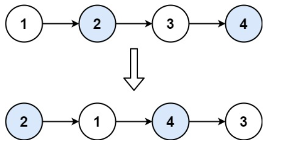

# Swap Nodes in Pairs
## Puzzle Description
Given a linked list, swap every two adjacent nodes and return its head. You must solve the problem without modifying the values in the list's nodes (i.e., only nodes themselves may be changed.)   
**Example:**


## Methodology
There are 4 situations will possibly happend. Given a linked list named ***ll***.
1. ***ll*** is an empty linked list. Then return ***head*** or ***nullptr***.
2.  ***ll*** is an one node linked list. Then reutnr ***head***.
3. ***ll*** is an two nodes linked list. Then can swich the position of the two nodes without considering the pointer points to the first node.
4. ***ll*** has above two nodes. Then after switching the first two nodes, we need to consider the pointer points to the first one node of the two nodes when doing switching. Refer to the codes for detail.

## Code
```cpp
/**
 * Definition for singly-linked list.
 * struct ListNode {
 *     int val;
 *     ListNode *next;
 *     ListNode() : val(0), next(nullptr) {}
 *     ListNode(int x) : val(x), next(nullptr) {}
 *     ListNode(int x, ListNode *next) : val(x), next(next) {}
 * };
 */

class Solution {
public:
    ListNode* swapPairs(ListNode* head) {
        ListNode* tpl;
        ListNode* tpr;
        ListNode* mid;

        if(head!=nullptr){
            if(head->next!=nullptr){
                if(head->next->next==nullptr){
                    mid=head;
                    tpr=head->next;
                    tpr->next=head;
                    head->next=nullptr;
                    return tpr;
                }
            }
            else{
                return head;
            }
        }
        else{
            return head;
        }

        ListNode* tp;
        mid=head;
        tpr=mid->next;
        tp=tpr->next;
        mid->next=tp;
        tpr->next=mid;
        head=tpr;
        tp=mid;
        mid=head;
        tpr=tp;

        while(tpr->next!=nullptr)
        {
            tpl=tpr;
            mid=tpr->next;
            tpr=mid->next;

            if(mid!=nullptr && tpr!=nullptr){
                tpl->next=tpr;
                tp=tpr->next;
                tpr->next=mid;
                mid->next=tp;
                tp=tpr;
                tpr=mid;
                mid=tp;
                continue;
            }
            else{
                return head;
            }
        }


        return head;
    }
};

```

## Evaluation
