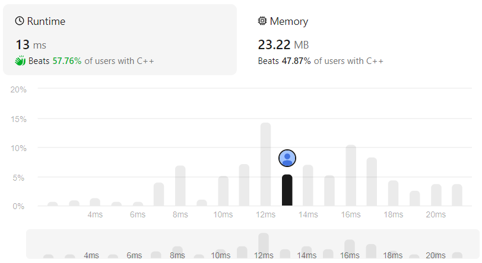

# Find Bottom Left Tree Value
## Link
[Find Bottom Left Tree Value]()

## Code
```cpp
class Solution {
public:
    int findBottomLeftValue(TreeNode* root) {
        queue<TreeNode*> que;
        TreeNode* tp=root;
        int btmlf;

        if(tp){
            que.push(tp);

            while(!que.empty()){
                int size=que.size();

                for(int i=0;i<size;i++){
                    if(i==0){
                        btmlf=que.front()->val;
                    }

                    if(que.front()->left){
                        que.push(que.front()->left);
                    }
                    if(que.front()->right){
                        que.push(que.front()->right);
                    }

                    que.pop();
                }
            }
        }

        return btmlf;
    }
};
```

## Evaluation
