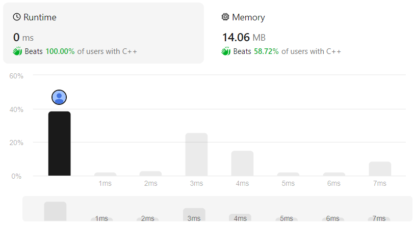
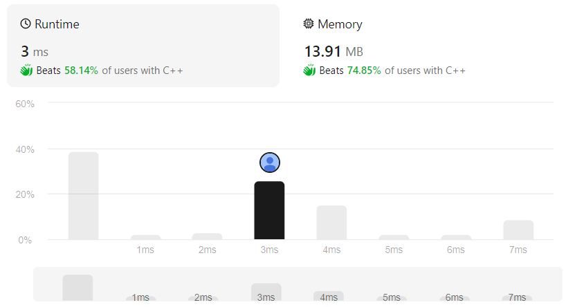

# Binary Tree Right Side View
## Puzzle Description
Given the `root` of a binary tree, imagine yourself standing on the **right side** of it, return *the values of the nodes you can see ordered from top to bottom*.

## Methodology
Easy

## Code
1. Iterative
```cpp
class Solution {
public:
    vector<int> rightSideView(TreeNode* root) {
        queue<TreeNode*> que;
        vector<int> ans;
        TreeNode* tp=root;
        int size;

        if(tp){
            que.push(tp);
        }

        while(!que.empty()){
            size=que.size();
            vector<int> line;

            for(int i=0;i<size;i++){
                tp=que.front();
                que.pop();

                line.push_back(tp->val);
                if(tp->right){
                    que.push(tp->right);
                }
                if(tp->left){
                    que.push(tp->left);
                }
            }

            ans.push_back(line[0]);
        }

        return ans;
    }
};
```

2. Recursive
```cpp
class Solution {
public:
    vector<int> rightSideView(TreeNode* root) {
        vector<int> ans;
        if(root){
            unit(ans, 0, root);
        }

        return ans;
    }

    void unit(vector<int>& ans, int depth, TreeNode* node){
        if(node){
            if(ans.size()==depth){
                ans.push_back(node->val);
            }
            unit(ans, depth+1, node->right);
            unit(ans, depth+1, node->left);
        }
    }
};
```

## Evaluation
1. Iterative    



2. Recursive    

