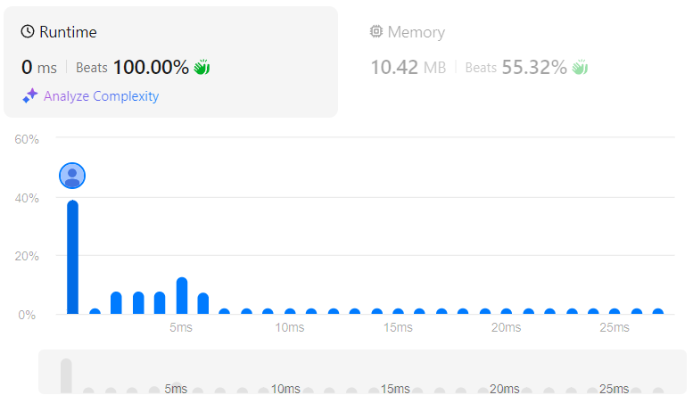

# Restore IP Addresses
## Link
[Restore IP Addresses](https://leetcode.com/problems/restore-ip-addresses/description/)

## Code
```cpp
class Solution {
private:
    vector<string> ans;
    vector<string> unit;
    int num=0;

    void bt(string s, int len){
        for(int i=0;i<unit.size();i++){
            num+=unit[i].size();
        }
        if(unit.size()==4 && num==len){
            string tp="";
            for(int i=0;i<4;i++){
                tp+=unit[i];
                tp+=".";
            }
            tp.pop_back();
            ans.push_back(tp);
            num=0;
            return ;
        }
        num=0;

        for(int i=0;i<s.size();i++){
            if(i>2){
                return ;
            }
            else if(i>0 && s[0]=='0'){
                return ;
            }
            else if(i==2 && ( ((int)s[0] - 48)>2 || stoi(s.substr(0,3))>255 )){
                return ;
            }

            unit.push_back(s.substr(0,i+1));
            bt(s.substr(i+1,s.size()-i-1), len);
            unit.pop_back();
        }
    }

public:
    vector<string> restoreIpAddresses(string s) {
        if (s.size() < 4 || s.size() > 12) return ans;  // cutting branches
        bt(s, s.size());
        return ans;
    }
};
```

## Evaluation
