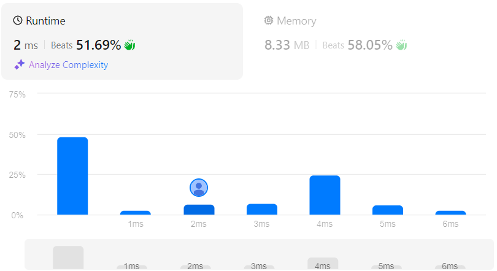

# Subsets
## Link
[Subsets](https://leetcode.com/problems/subsets/description/)

## Code
```cpp
class Solution {
private:
    vector<int> core;
    vector<vector<int>> ans;

    void bt(vector<int>& nums, int len, int index){
        if(core.size()==len){
            ans.push_back(core);
            return ;
        }
        if(index>=nums.size()){
            return ;
        }

        for(int i=index;i<nums.size();i++){
            core.push_back(nums[i]);
            bt(nums, len, i+1);
            core.pop_back();
        }
    }
public:
    vector<vector<int>> subsets(vector<int>& nums) {
        for(int i=0;i<=nums.size();i++){
            bt(nums, i, 0);
        }
        
        return ans;
    }
};
```

## Evaluation
