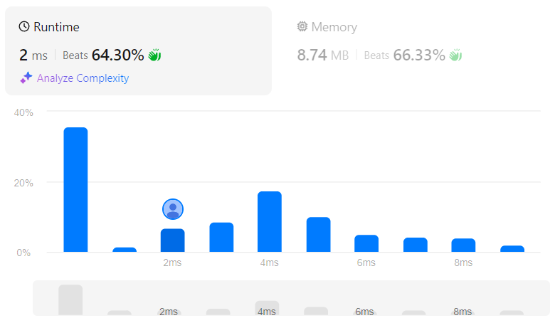

# Subsets II
## Link
[Subsets II](https://leetcode.com/problems/subsets-ii/description/)

## Code
```cpp
class Solution {
private:
    vector<int> ele;
    vector<vector<int>> ans;

    void bt(vector<int>& nums, int index, int len){
        if(len==0){
            ans.push_back(ele);
            return ;
        }
        else if(ele.size()==len){
            ans.push_back(ele);
            return ;
        }

        for(int i=index;i<nums.size();i++){
            if(i>index && nums[i]==nums[i-1]) continue;

            ele.push_back(nums[i]);
            bt(nums, i+1, len);
            ele.pop_back();
        }
    }


public:
    vector<vector<int>> subsetsWithDup(vector<int>& nums) {
        sort(nums.begin(), nums.end());

        for(int i=0;i<=nums.size();i++){
            bt(nums, 0, i);
        }

        return ans;
    }
};
```

## Evaluation
