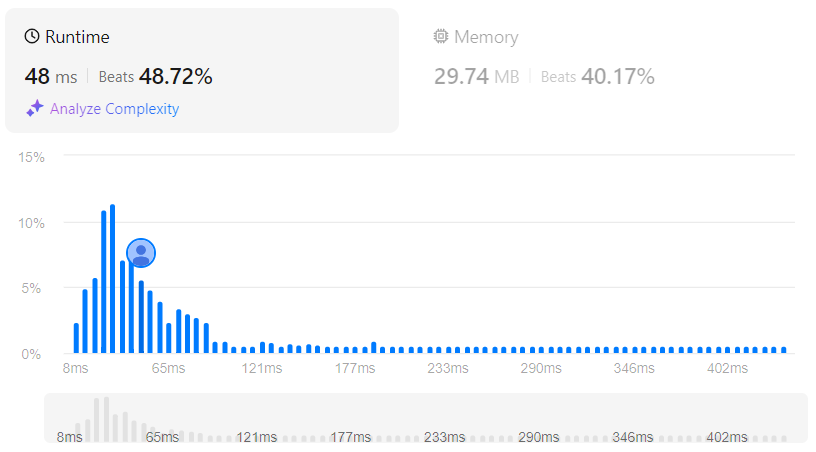

# Non-decreasing Subsequences
## Link
[Non-decreasing Subsequences](https://leetcode.com/problems/non-decreasing-subsequences/description/)

## Code
```cpp
class Solution {
private:
    vector<vector<int>> ans;
    vector<int> ele;
    

    void backtrack(vector<int>& nums, int index){
        if(ele.size()>1&&ele[ele.size()-1]>=ele[ele.size()-2]){
            ans.push_back(ele);
        }
        else if(ele.size()>1&&ele[ele.size()-1]<ele[ele.size()-2]){
            return ;
        }

        unordered_set<int> used;
        for(int i=index;i<nums.size();i++){
            if(used.find(nums[i])!=used.end())  
                continue;
            else{
                used.insert(nums[i]);
                ele.push_back(nums[i]);
                backtrack(nums, i+1);
                ele.pop_back();
            }
        }
    }

public:
    vector<vector<int>> findSubsequences(vector<int>& nums) {
        backtrack(nums, 0);
        return ans;
    }
};
```

## Evaluation
