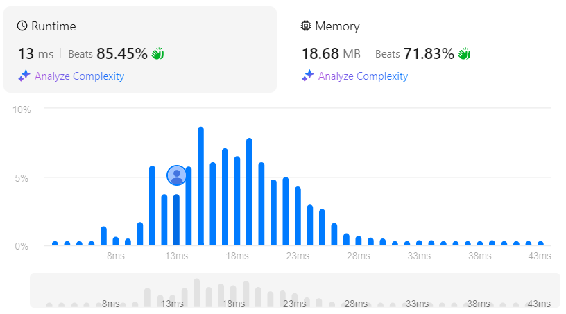

# Reconstruct Itinerary
## Link
[Reconstruct Itinerary](https://leetcode.com/problems/reconstruct-itinerary/description/)

## Code
```cpp
class Solution {
public:
    unordered_map<string, map<string, int>> dna;
    vector<string> ans;

    bool bt(int num){
        if(ans.size()==num){
            tp=ans;
            return true;
        }

        for(auto& mp:dna[ans.back()]){
            if(mp.second>0){
                ans.push_back(mp.first);
                --mp.second;
                if(bt(num)) return true;
                ++mp.second;
                ans.pop_back();
            }
        }

        return false;
    }

public:
    vector<string> findItinerary(vector<vector<string>>& tickets) {
        for(auto vec: tickets){
            dna[vec[0]][vec[1]]++;
        }
        ans.push_back("JFK");
        //bt(tickets.size()+1);
        return ans;
    }
};
```

## Evaluation
