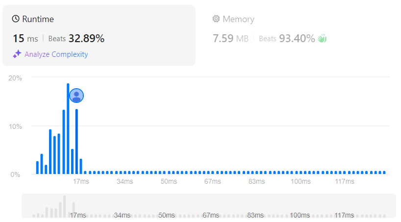

# Sudoku Solver
## Link
[Sudoku Solver](https://leetcode.com/problems/sudoku-solver/description/)

## Code
```cpp
class Solution {
private:
    vector<vector<char>> ans;
    vector<char> unit;

    bool check(vector<vector<char>>& board, int row, int col, char c){
        for(int i=0;i<board.size();i++){
            if(board[i][col]==c){
                return false;
            }
            else if(board[row][i]==c){
                return false;
            }
        }

        int x = row/3;
        int y = col/3;

        for(int i=0;i<3;i++){
            for(int j=0;j<3;j++){
                if(board[x*3+i][y*3+j]==c){
                    return false;
                }
            }
        }

        return true;
    }

    bool bt(vector<vector<char>>& board){
        for(int row=0;row<board.size();row++){
            for(int col=0;col<board.size();col++){
                if(board[row][col]=='.'){
                    for(char c='1';c<='9';c++){
                        if(check(board, row, col, c)){
                            board[row][col] = c;
                            if(bt(board)) return true;
                            board[row][col] = '.';
                        }
                    }

                    return false;
                }

            }
        }

        return true;
    }
public:
    void solveSudoku(vector<vector<char>>& board) {
        bt(board);
    }
};
```

## Evaluation
