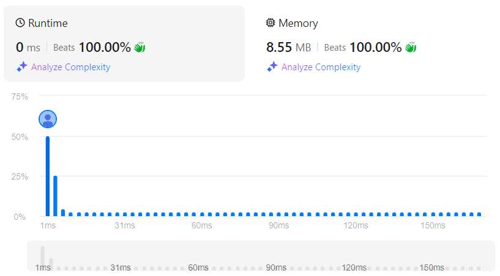

# Wiggle Subsequence
## Link
[Wiggle Subsequence](https://leetcode.com/problems/wiggle-subsequence/description/)

## Code
```cpp
class Solution {
private:
    int num=0;
public:
    int wiggleMaxLength(vector<int>& nums) {
        while(1){
            if(nums.size()==1){
                return 1;
            }
            else if(nums.size()==2&&nums[0]!=nums[1]){
                return 2;
            }
            else if(nums.size()==2&&nums[0]==nums[1]){
                return 1;
            }

            for(int i=0;i<(int)(nums.size()-2);){
                if(nums[i]==nums[i+1]){
                    nums.erase(nums.begin()+i);
                    continue;
                }
                else if(nums[i+1]==nums[i+2]){
                    nums.erase(nums.begin()+i+1);
                    continue;
                }


                if(((nums[i+2]-nums[i+1])^(nums[i+1]-nums[i]))<0){
                    ++num;
                    ++i;
                    continue;
                }
                else{
                    nums.erase(nums.begin()+i);
                    continue;
                }
            }

            if(nums.size()<3){
                continue;
            }
            else{
                return num+2;
            }
        }
        
        return 1;
    }
};
```

## Evaluation
