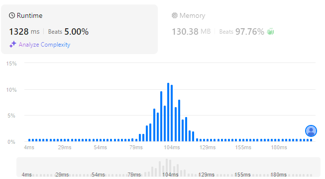

# Gas Station
## Link
[Gas Station](https://leetcode.com/problems/gas-station/description/)

## Code
```cpp
class Solution {
private:
    int sum=0;
public:
    int canCompleteCircuit(vector<int>& gas, vector<int>& cost) {
        for(int i=0;i<gas.size();++i){
            sum+=gas[i]-cost[i];
        }
        if(sum<0){
            return -1;
        }

        if(gas==cost)   return 0;

        for(int i=0;i<gas.size();++i){
            if(gas[i]-cost[i]<=0){
                continue;
            }

            int left=0, index=i, num=0;
            for(int j=0;j<gas.size();++j){
                if(index==gas.size()){
                    index=0;
                }

                if(left+gas[index]>=cost[index]){
                    left=left+gas[index]-cost[index];
                    ++index;
                    ++num;
                    continue;
                }
                break;
            }

            if(num==gas.size()){
                return i;
            }
        }

        return -1;
    }
};
```

## Evaluation
