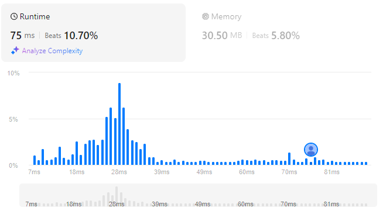

# Queue Reconstruction by Height
## Link
[Queue Reconstruction by Height](https://leetcode.com/problems/queue-reconstruction-by-height/description/)

## Code
```cpp
class Solution {
public:
    static bool cmp(vector<int> lf, vector<int> rt){
        if(lf[0]==rt[0]){
            return lf[1]<rt[1];
        }
        return lf[0]>rt[0];
    }

    vector<vector<int>> reconstructQueue(vector<vector<int>>& people) {
        list<vector<int>> ans;

        sort(people.begin(), people.end(), cmp);

        for(int i=0;i<people.size();++i){
            list<vector<int>>::iterator it = ans.begin();
            while(people[i][1]){
                ++it;
                --people[i][1];
            }
            ans.insert(it, people[i]);
        }

        return vector<vector<int>>(ans.begin(), ans.end());
    }
};
```

## Evaluation
