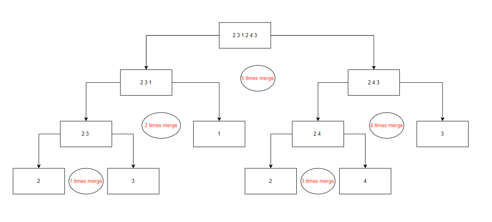
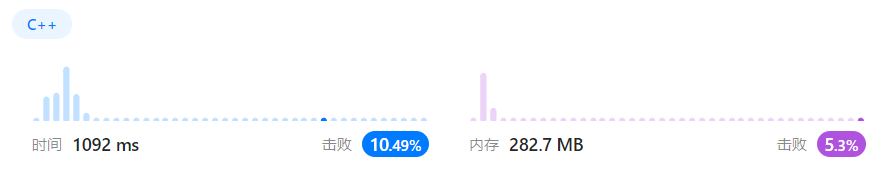

# Merge Sort
## Puzzle Description
Given an array of integers ***nums***, sort the array in ascending order and return it using merge sort.

## Methodology
The principle of merge sort is reducing the times of comparing by recursion. We could reduce the comparing times from K to log2(K). Firstly we compare two elements and return a sorted ascending set. Secondly we compare two small ascending sets to form a large ascending set. We repeat the second step until we get the set comprising all of the elements in the original set.

For example, giving an array ***std::vector<int> vv={2,3,1,2,4,3}***. The processing steps are shown below in detail.


## Code
```c++
void merge(std::vector<int>&nums, int left, int right);
void recursion(std::vector<int>& nums, int left, int right);

int main(){
    std::vector<int> nums={2,3,1,2,4,3}; 

    /* Function */
    int len=nums.size();
    int left=0,right=len-1;
    recursion(nums,left,right);

    return 0;
}

void recursion(std::vector<int>& nums, int left, int right){
    if(left==right){
        return;
    }
    
    recursion(nums, left, (left+right)/2);
    recursion(nums,((left+right)/2)+1, right);
    merge(nums, left, right);
    return;
}

void merge(std::vector<int>& nums, int left, int right){
    std::vector<int> v;

    int mid=(left+right)/2;
    int i=left,j=mid+1;

    while(i<mid+1&&j<right+1){
        if(nums[i]<=nums[j]){
            v.push_back(nums[i]);
            ++i;
        }
        else{
            v.push_back(nums[j]);
            ++j;
        }
    }

    while(i<mid+1){
        v.push_back(nums[i]);
        ++i;
    }
    while(j<right+1){
        v.push_back(nums[j]);
        ++j;
    }
    std::cout<<"left="<<left<<std::endl;
    std::cout<<"right="<<right<<std::endl;
    for(int k=0;k<v.size();k++){
        std::cout<<v[k]<<std::endl;
    }
    std::cout<<"==================="<<std::endl;
    for(i=left, j=0;i<=right;i++,j++){
        nums[i]=v[j];
    }
}

```

## Evaluation
